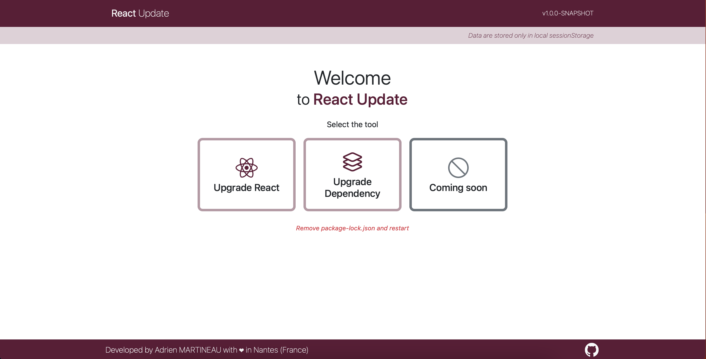

# React Update
You use React and want to better manage your version upgrades?

This project is made for you! 😎

- [Features](#bookmark_tabs-features)
- [Usage](#memo-usage)
- [Licence](#balance_scale-licence)
- [Contributors](#handshake-contributors)

## :bookmark_tabs: Features
This tool allows :
- Check that your dependencies are compatible with new versions of React
- Check that your version of React is compatible with new versions of your React plugins/dependencies.
- And more... soon

## :memo: Usage
First, you must import your package-lock.json (not package.json).
> **Warning**
> Only lockfileVersion > 1 are allowed (from NPM 7).

> **Note**
> Your package-lock.json is not stored in any database, only in sessionStorage in your browser.

Go here : https://wazer-adrien.github.io/react-update

After this, you must select a tool:

- Upgrade React :
  - Select the targeted React version and that's it! 😃
- Upgrade Dependency/Plugin :
  - Select the targeted plugin
  - Select the targeted version of this plugin

## :balance_scale: Licence
[MIT](LICENSE)

## :handshake: Contributors
Do not hesitate to participate in the project!
Contributors list will be displayed below.
