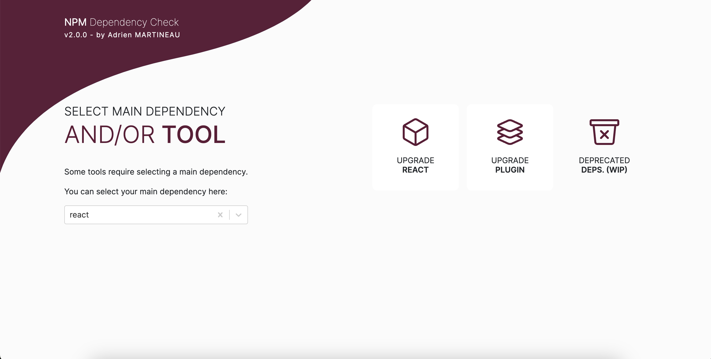

# NPM Dependency Check
You want to better manage your version upgrades ?

This project is made for you! 😎

- [Features](#bookmark_tabs-features)
- [Usage](#memo-usage)
- [Licence](#balance_scale-licence)
- [Contributors](#handshake-contributors)

## :bookmark_tabs: Features
This project allows :
- Check that your dependencies are compatible with old/new versions of a specific dependency from your package-lock
- Check that your version of a specific dependency is compatible with a version of plugin of this dependency.
- Check that your dependencies are not deprecated (WIP)

## :memo: Usage
First, you must import your package-lock.json (not package.json).
> **Warning**
> Only lockfileVersion > 1 are allowed (from NPM 7).

> **Note**
> Your package-lock.json is not stored in any database, only in sessionStorage in your browser.

Go here : https://wazer-adrien.github.io/npm-dependency-check

First:
1. select your package-lock.json:

2. select main dependency (used for "Upgrade Main Dep." and "Upgrade Plugin" tools)

3. select the tool :)

### Tools:
- Upgrade Main Dependency:
  - Select the targeted React version
  - Show incompatibles dependencies and that's it! 😃
- Upgrade Dependency/Plugin:
  - Select the target plugin
  - Select the target version of this plugin
  - Show if the plugin's version is compatible and that's it! 😃
- Deprecated Dependencies:
  - Show your deprecated dependencies 😃

## :balance_scale: Licence
[MIT](LICENSE)

## :handshake: Contributors
Do not hesitate to participate in the project!
Contributors list will be displayed below.
